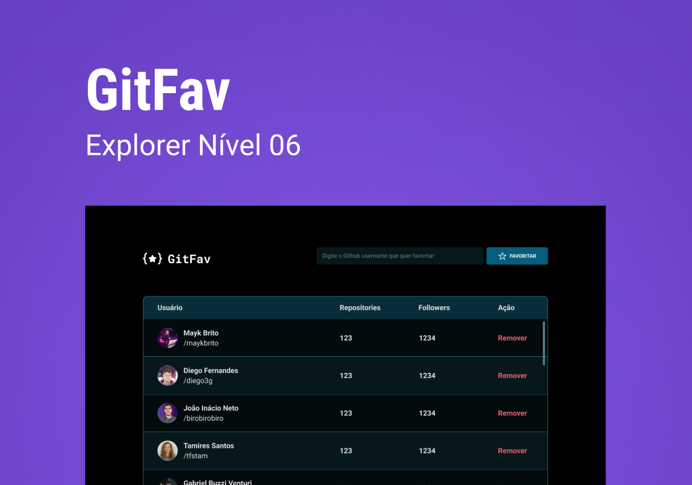

  

## 💻 Projeto

O GitFav é um programa que utiliza a API do github para buscar usuários que você deseja favoritar.
Deixa salvo e de fácil acesso, para quando quiser acessar o repositório daquele determinado usuário

## 🚀 Tecnologias

Esse projeto foi desenvolvido com as seguintes tecnologias:

- HTML
- CSS
- Javascript
- Git e Github

## 🏷️ Layout

Você pode visualizar o layout do projeto através
[desse link](<https://www.figma.com/file/dtwlzne3DtpVEoAFq3FObO/%5BDesafios-Explorer%5D-GitFav-(Copy)-(Copy)?type=design&node-id=104%3A48&mode=design&t=jNajCdQqmxpylFUz-1>)
É necessário ter uma conta no [Figma](https://www.figma.com)

Desenvolvido por [Gabriel George](https://www.linkedin.com/in/gabrielgeorgesilva/)